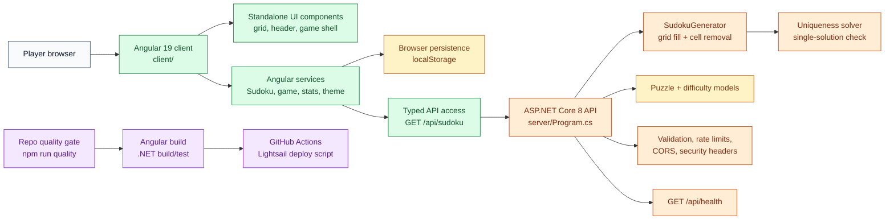
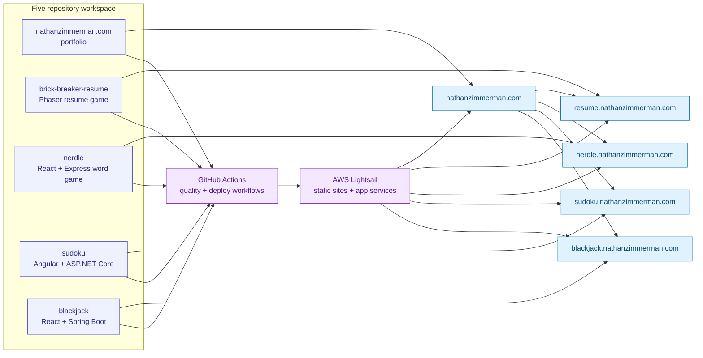

# Architecture

## Runtime Topology

Sudoku is a full-stack application with an Angular 19 client in `client/` and an ASP.NET Core 8 API in `server/`. The client calls the backend for generated puzzles and keeps local UI/session state in the browser.

## Architecture Diagram

## Source Boundaries

The backend owns puzzle generation, uniqueness checks, difficulty mapping, API validation, rate limiting, CORS, security headers, and health checks. The Angular client owns board rendering, input validation feedback, timer behavior, local persistence, theme state, and typed service access to the API.

## Quality Gates

Run `npm run quality` from the repo root after installing root and client npm dependencies. The gate checks Prettier formatting, Angular coverage, the Angular production build, .NET restore/build/test, Cobertura report generation, and backend coverage enforcement.

## Deployment Flow

GitHub Actions runs the root quality gate for pull requests and pushes to `main`. Pushes to `main` SSH to Lightsail and run the external deploy script for this repository, then check the client and `/api/health`.

## Workspace Connectivity

## Deferred Architecture Follow-Ups

Keep Angular ESLint adoption separate from this pass. Future work can add a .NET formatter/analyzer profile and move the report generator dependency from a global CI tool to a pinned local tool manifest.
